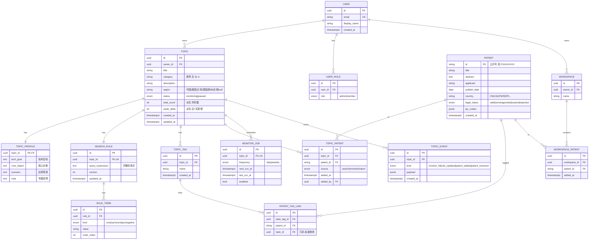
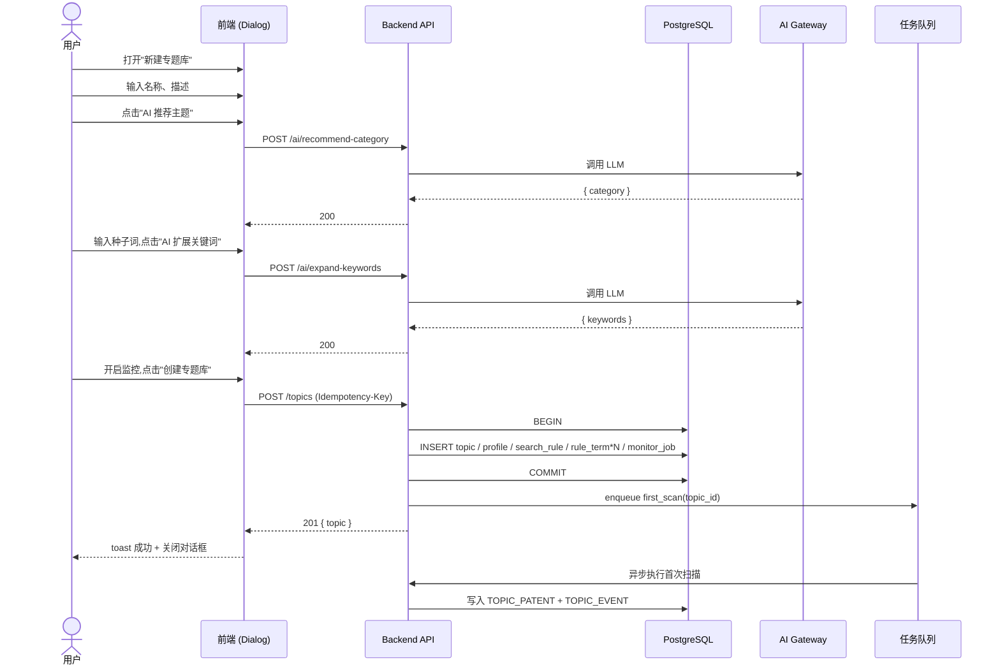
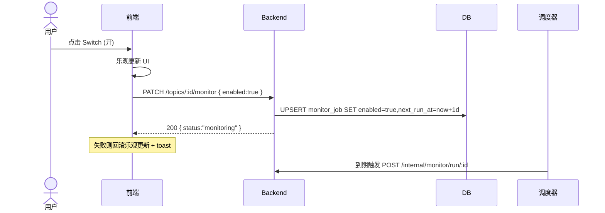
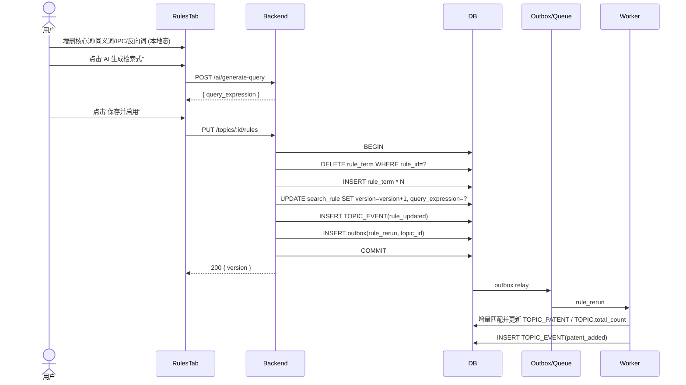
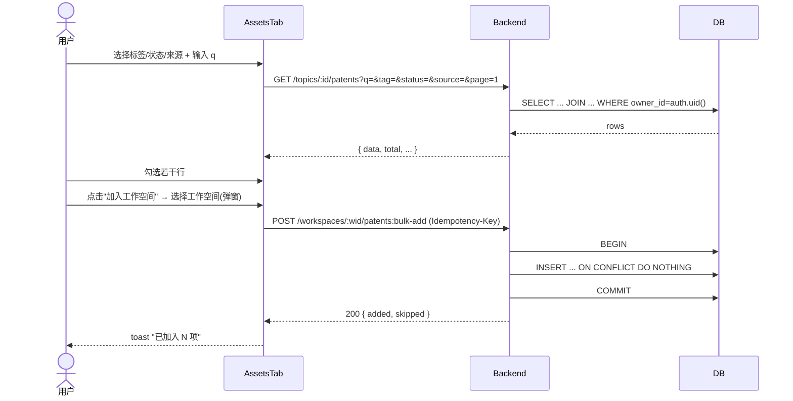
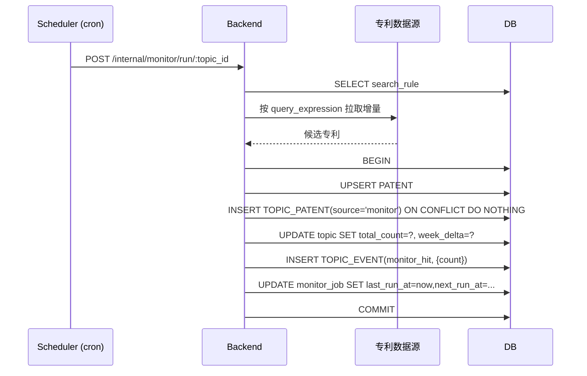

# AI 专利创新空间 — 后端 API 设计文档

> 版本：v1.0  
> 范围：基于当前前端代码（专题专题库、专题详情、新建专题对话框）所有交互的后端契约。  
> 标注图例：🟢 需要后端 API ｜ 🟡 本地状态（前端内存/localStorage 即可）｜ ⚪ 纯展示（mock/静态数据，可后端接管）

---

## 0. 目录

1. [实体与数据模型](#1-实体与数据模型)
2. [非功能需求](#2-非功能需求)
3. [全量交互清单与归类](#3-全量交互清单与归类)
4. [API 接口清单](#4-api-接口清单)
5. [关键业务流程时序图](#5-关键业务流程时序图)
6. [错误码规范](#6-错误码规范)

---

## 1. 实体与数据模型

### 1.1 ER 图



### 1.2 字段约束摘要

| 实体 | 字段 | 约束 |
|---|---|---|
| TOPIC | title | NOT NULL, 长度 1–80, 同一用户内 unique |
| TOPIC | category | 枚举值（§1.3），可空 |
| TOPIC | status | 默认 `paused` |
| TOPIC_TAG | (topic_id, name) | unique |
| TOPIC_PATENT | (topic_id, patent_id) | unique（同一专利在专题内不重复） |
| RULE_TERM | (rule_id, kind, value) | unique |
| SEARCH_RULE | query_expression | 长度 ≤ 8000 |
| PATENT_TAG_LINK | (topic_tag_id, patent_id) | unique |
| MONITOR_JOB | topic_id | unique（一个专题一个监控任务） |

### 1.3 枚举常量

- **TOPIC.category**（与 `src/data/categories.ts` 对齐，13 项）：  
  `人工智能与数据智能｜半导体与电子信息｜通信与网络｜智能制造与工业装备｜新能源与储能｜新材料｜生物医药与医疗器械｜汽车与智能交通｜航空航天与无人系统｜环保与绿色低碳｜消费电子与智能终端｜农业与食品科技｜其他`
- **TOPIC.status**：`monitoring | paused`
- **PATENT.legal_status**：`valid | review | granted | expired | rejected`
- **TOPIC_PATENT.source**：`search | monitor | import`
- **RULE_TERM.kind**：`core | synonym | ipc | negative`
- **TOPIC.region**：`中国 | 美国 | 日本 | 韩国 | 欧洲 | 全球`

---

## 2. 非功能需求

### 2.1 鉴权
- 方式：基于 Lovable Cloud（Supabase）的 JWT Bearer Token，前端 `Authorization: Bearer <access_token>`。
- 所有 `/api/**` 接口默认要求登录；公开接口在 §4 单独标注。
- 权限：通过 `user_roles` 表 + `has_role(uid, role)` security definer 函数判断（**禁止** 在 profile 表存角色）。
- 资源级权限：所有 TOPIC/WORKSPACE 资源仅 `owner_id = auth.uid()` 可读写（RLS 策略）。

### 2.2 分页
- 统一 query 参数：`?page=1&page_size=20`（page_size 上限 100）。
- 响应统一：
  ```json
  { "data": [...], "page": 1, "page_size": 20, "total": 137, "total_pages": 7 }
  ```

### 2.3 排序与筛选
- 排序：`?sort=field` 或 `-field`（前缀 `-` 表示降序），多字段用逗号。
- 多值筛选：`?status=valid,review`（逗号分隔），`?tag=A&tag=B`（重复 key）均支持。

### 2.4 幂等性
- 所有 `POST /collections`、`POST /actions/bulk-*` 接口必须支持 `Idempotency-Key` 头部（24h 内重复请求返回首次结果）。
- `PUT/PATCH` 天然幂等。
- 监控开关 `PATCH /topics/:id/monitor` 设计为幂等（重复设置同状态返回 200）。

### 2.5 事务边界
| 操作 | 事务 |
|---|---|
| 创建专题（topic + profile + tags + rule + monitor_job） | 单事务，全部成功或全部回滚 |
| 批量加入专利到专题 | 单事务，部分失败整体回滚，返回 422 + 失败明细 |
| 更新检索规则（terms 全替换 + version+1 + 触发重跑） | 单事务，事务内仅持久化；重跑通过 outbox 异步触发 |
| 删除专题 | 级联删除 profile/tags/rule/topic_patents/monitor_job/events（数据库 ON DELETE CASCADE） |

### 2.6 速率限制
- 每用户：常规读 600 req/min，写 60 req/min。
- AI 类接口（推荐分类、扩展关键词、生成检索式）：10 req/min/用户。

### 2.7 缓存
- `GET /topics/:id/overview`（图表聚合）服务端缓存 5 分钟，规则更新或新专利入库时 invalidate。

---

## 3. 全量交互清单与归类

> 覆盖侧边栏、专题专题库列表页、新建专题对话框、专题详情 4 个 Tab 的**所有**可交互元素。

### 3.1 全局 / AppLayout / AppSidebar

| 编号 | 交互 | 类型 | 说明 |
|---|---|---|---|
| G-1 | 侧边栏导航高亮 | 🟡 | 由 `useLocation` 计算 |
| G-2 | Logo / 公司名展示 | ⚪ | 静态 |
| G-3 | 路由 `/search`、`/new-chat`、`/subscriptions`、`/workspace`、`/history` | 🟢 | 当前为占位，每个模块需独立 API（本文档不展开，预留命名空间） |

### 3.2 专题库列表页 `/`（TopicLibrary）

| 编号 | 交互 | 类型 | API |
|---|---|---|---|
| L-1 | 加载专题列表 | 🟢 | `GET /topics` |
| L-2 | 关键字搜索（title / category 包含） | 🟢 | `GET /topics?q=` |
| L-3 | 专题分类筛选（单选，13 枚举） | 🟢 | `GET /topics?category=` |
| L-4 | 标签筛选（多选，OR 语义） | 🟢 | `GET /topics?tag=A&tag=B` |
| L-5 | 状态筛选（all/monitoring/paused） | 🟢 | `GET /topics?status=` |
| L-6 | "清除筛选" | 🟡 | 仅前端重置 query |
| L-7 | 卡片 Switch 切换监控开关 | 🟢 | `PATCH /topics/:id/monitor` |
| L-8 | 卡片点击进入详情 | 🟡 | 路由跳转 |
| L-9 | 卡片"更多"按钮（MoreHorizontal） | 🟢 | 预留：重命名/删除/复制（见 §4.2） |
| L-10 | "新建专题库"按钮 → 打开对话框 | 🟡 | 本地状态 |
| L-11 | 卡片显示 total / weekDelta / updatedAt | 🟢 | 由 L-1 返回 |
| L-12 | 标签下拉选项来源（取自所有专题已存在 tag 去重） | 🟢 | `GET /topics/tags`（或通过 L-1 派生） |

### 3.3 新建专题对话框（CreateTopicDialog）

| 编号 | 交互 | 类型 | API |
|---|---|---|---|
| C-1 | 名称输入（必填，唯一性校验） | 🟡 输入 / 🟢 提交 | 提交时校验 |
| C-2 | 描述输入 | 🟡 | — |
| C-3 | 主题分类下拉（13 枚举） | 🟡 | 选项来自前端常量 |
| C-4 | "AI 推荐主题" | 🟢 | `POST /ai/recommend-category` |
| C-5 | 覆盖国家/地区下拉（6 枚举） | 🟡 | — |
| C-6 | 关键词输入 + Enter 添加 / "+" 添加 | 🟡 | — |
| C-7 | 关键词去重提示 | 🟡 | toast |
| C-8 | 删除单个关键词 | 🟡 | — |
| C-9 | "AI 扩展关键词" | 🟢 | `POST /ai/expand-keywords` |
| C-10 | 动态监控 Switch | 🟡 | — |
| C-11 | 取消按钮（重置表单 + 关闭） | 🟡 | — |
| C-12 | 创建专题库（提交） | 🟢 | `POST /topics`（事务） |

### 3.4 专题详情 `/topic/:id`（TopicDetail）

| 编号 | 交互 | 类型 | API |
|---|---|---|---|
| D-1 | 加载专题元数据 + Profile | 🟢 | `GET /topics/:id` |
| D-2 | "返回专题库"链接 | 🟡 | 路由 |
| D-3 | 顶部"动态监测"Switch | 🟢 | `PATCH /topics/:id/monitor` |
| D-4 | "编辑专题"按钮 | 🟢 | `PATCH /topics/:id`（预留） |
| D-5 | "创建工作空间"按钮 | 🟢 | `POST /workspaces`（预留） |
| D-6 | 头部统计：专利总数 / 近一周新增 / 核心申请人/总申请人 | 🟢 | `GET /topics/:id`（聚合字段） |
| D-7 | Tabs 切换（overview/assets/rules/tags） | 🟡 | URL hash 或本地 |

#### 3.4.1 概览 Tab（OverviewTab）

| 编号 | 交互 | 类型 | API |
|---|---|---|---|
| O-1 | 顶部"动态提醒"横幅（最新候选数） | 🟢 | `GET /topics/:id/events?kind=monitor_hit&latest=true` |
| O-2 | 主题画像 4 字段展示 | 🟢 | `GET /topics/:id/profile`（含在 D-1） |
| O-3 | 年度申请趋势柱状图 | 🟢 | `GET /topics/:id/overview/yearly` |
| O-4 | 国家/地区分布饼图 | 🟢 | `GET /topics/:id/overview/regions` |
| O-5 | 核心申请人 Top 排行 | 🟢 | `GET /topics/:id/overview/applicants?limit=5` |
| O-6 | 图表 Tooltip / 颜色 | ⚪ | 纯前端 |

#### 3.4.2 专利资产 Tab（AssetsTab）

| 编号 | 交互 | 类型 | API |
|---|---|---|---|
| A-1 | 加载专利列表（默认分页） | 🟢 | `GET /topics/:id/patents` |
| A-2 | 搜索（title / abstract / applicant 包含） | 🟢 | `?q=` |
| A-3 | 标签筛选（多选，OR） | 🟢 | `?tag=A&tag=B` |
| A-4 | 法律状态筛选（多选） | 🟢 | `?status=valid,review` |
| A-5 | 来源筛选（单选 search/monitor/import） | 🟢 | `?source=` |
| A-6 | 已选 chip 行（清除单个 / 清除全部） | 🟡 | — |
| A-7 | 行 Checkbox 选择 / 全选 | 🟡 | 选中 ID 集合本地 |
| A-8 | "已选 N 项"计数 | 🟡 | — |
| A-9 | "加入工作空间"按钮 | 🟢 | `POST /workspaces/:wid/patents:bulk-add` |
| A-10 | "移除"按钮（从专题移除） | 🟢 | `DELETE /topics/:id/patents:bulk-remove`（幂等） |
| A-11 | 上一页 / 下一页 | 🟢 | `?page=` |
| A-12 | 行展示状态徽章 / 来源文案 | ⚪ | 前端映射 |
| A-13 | 排序（按日期/状态等，预留） | 🟢 | `?sort=-publish_date` |

#### 3.4.3 检索规则 Tab（RulesTab）

| 编号 | 交互 | 类型 | API |
|---|---|---|---|
| R-1 | 加载 4 组词 + 当前检索式 | 🟢 | `GET /topics/:id/rules` |
| R-2 | 添加 / 删除 核心关键词 | 🟡 编辑态 / 🟢 保存 | 保存时 PUT |
| R-3 | 添加 / 删除 同义词 | 🟡 / 🟢 | 同上 |
| R-4 | 添加 / 删除 IPC/CPC | 🟡 / 🟢 | 同上 |
| R-5 | 添加 / 删除 反向词 | 🟡 / 🟢 | 同上 |
| R-6 | "AI 扩展" 核心词 | 🟢 | `POST /ai/expand-keywords` |
| R-7 | "AI 推荐"同义词 | 🟢 | `POST /ai/recommend-synonyms` |
| R-8 | "AI 推荐分类号" | 🟢 | `POST /ai/recommend-ipc` |
| R-9 | "AI 推荐"反向词 | 🟢 | `POST /ai/recommend-negatives` |
| R-10 | 检索式 Textarea 编辑 | 🟡 | — |
| R-11 | "AI 生成检索式" | 🟢 | `POST /ai/generate-query` |
| R-12 | "取消" | 🟡 | 重置为服务端版本 |
| R-13 | "保存并启用" | 🟢 | `PUT /topics/:id/rules`（事务+触发重跑） |

#### 3.4.4 标签 Tab（TagsTab）

| 编号 | 交互 | 类型 | API |
|---|---|---|---|
| T-1 | 加载专题标签 | 🟢 | `GET /topics/:id/tags` |
| T-2 | 删除标签 | 🟢 | `DELETE /topics/:id/tags/:tagId` |
| T-3 | 添加标签 | 🟢 | `POST /topics/:id/tags` |
| T-4 | 标签计数 | 🟡 | 由 T-1 派生 |

---

## 4. API 接口清单

### 约定
- BasePath：`/api/v1`
- 所有时间字段 ISO 8601（UTC）
- 错误响应统一：`{ "error": { "code": "TOPIC_NOT_FOUND", "message": "...", "details": {...} } }`

### 4.1 专题 Topics

#### 4.1.1 列出专题 — 对应 L-1~L-5, L-12
- **GET** `/topics`
- 权限：登录用户（仅返回 `owner_id = self`）
- Query：
  - `q?: string` 标题/分类模糊
  - `category?: enum`
  - `tag?: string[]`（重复 key，OR）
  - `status?: monitoring|paused`
  - `page?, page_size?, sort?`（默认 `-updated_at`）
- 200 出参：
  ```json
  {
    "data": [{
      "id": "uuid", "title": "...", "category": "新能源与储能",
      "description": "...", "total_count": 2847, "week_delta": 36,
      "updated_at": "2026-04-12T03:00:00Z", "status": "monitoring",
      "tags": ["硫化物电解质", "..."]
    }],
    "page": 1, "page_size": 20, "total": 6, "total_pages": 1
  }
  ```
- 错误：401

#### 4.1.2 创建专题 — 对应 C-12
- **POST** `/topics` （Idempotency-Key 必需）
- 业务规则：
  1. `title` 在当前用户下唯一
  2. 至少 1 个 keyword
  3. 单事务创建：topic + profile（空）+ tags（无）+ search_rule（仅 core terms）+ monitor_job（按 monitoring 字段）
  4. `monitoring=true` 时立即触发首次监控扫描（异步）
- 入参：
  ```json
  {
    "title": "固态电池电解质",
    "description": "...",
    "category": "新能源与储能",
    "region": "全球",
    "keywords": ["固态电解质", "全固态电池"],
    "monitoring": true
  }
  ```
- 201 出参：完整 Topic 对象
- 错误：400（校验）、409（同名 `TOPIC_NAME_EXISTS`）、422（关键词为空）

#### 4.1.3 获取专题详情 — 对应 D-1, D-6
- **GET** `/topics/:id`
- 出参包含 `profile`、`stats`（total / week_delta / core_applicants_count / total_applicants_count）

#### 4.1.4 更新专题元数据 — 对应 D-4
- **PATCH** `/topics/:id`
- 入参：可选 `title/description/category/region/profile{...}`

#### 4.1.5 删除专题
- **DELETE** `/topics/:id`
- 级联删除（§2.5）

#### 4.1.6 切换监控开关 — 对应 L-7, D-3
- **PATCH** `/topics/:id/monitor`
- 入参：`{ "enabled": true }`
- 幂等；`true` 时若 monitor_job 不存在则创建，`false` 时仅置 `enabled=false`

#### 4.1.7 全量标签字典（用于列表筛选下拉）— 对应 L-12
- **GET** `/topics/tags?scope=mine`
- 出参：`{ "tags": ["硫化物电解质", ...] }`

### 4.2 概览聚合 Overview

#### 4.2.1 年度趋势 — O-3
- **GET** `/topics/:id/overview/yearly?from=2020&to=2025`
- 出参：`[{ "year": "2020", "value": 320 }, ...]`

#### 4.2.2 区域分布 — O-4
- **GET** `/topics/:id/overview/regions`
- 出参：`[{ "name": "中国", "value": 1420 }, ...]`

#### 4.2.3 申请人 Top — O-5
- **GET** `/topics/:id/overview/applicants?limit=5`

#### 4.2.4 最新动态事件 — O-1
- **GET** `/topics/:id/events?kind=monitor_hit&limit=1`

### 4.3 专利资产 Patents

#### 4.3.1 列出专题内专利 — A-1~A-5, A-11, A-13
- **GET** `/topics/:id/patents`
- Query：
  - `q?` `tag?[]` `status?[]` `source?` `country?[]`
  - `sort?`（默认 `-publish_date`）
  - `page?, page_size?`
- 出参：分页结构，单项含 `{ id, title, applicant, publish_date, country, legal_status, source, tags[] }`

#### 4.3.2 批量从专题移除 — A-10
- **DELETE** `/topics/:id/patents:bulk-remove`（Idempotency-Key 必需）
- 入参：`{ "patent_ids": ["CN1...", "..."] }`
- 业务规则：跳过不存在的；返回 `{ removed: 5, skipped: 1 }`
- 错误：403（非 owner）

#### 4.3.3 批量加入工作空间 — A-9
- **POST** `/workspaces/:wid/patents:bulk-add`（Idempotency-Key 必需）
- 入参：`{ "patent_ids": [...] }`
- 业务规则：去重，已存在视为成功

### 4.4 标签 Tags

#### 4.4.1 列出专题标签 — T-1
- **GET** `/topics/:id/tags`

#### 4.4.2 添加标签 — T-3
- **POST** `/topics/:id/tags`
- 入参：`{ "name": "界面工程" }`
- 错误：409 `TAG_EXISTS`

#### 4.4.3 删除标签 — T-2
- **DELETE** `/topics/:id/tags/:tagId`
- 业务规则：级联删除 PATENT_TAG_LINK

### 4.5 检索规则 Rules

#### 4.5.1 获取规则 — R-1
- **GET** `/topics/:id/rules`
- 出参：
  ```json
  {
    "version": 3,
    "core":     ["固态电解质", "..."],
    "synonyms": ["..."],
    "ipc":      ["H01M10/0562"],
    "negative": ["液态", "凝胶"],
    "query_expression": "(\"固态电解质\" OR ...) AND ...",
    "updated_at": "..."
  }
  ```

#### 4.5.2 保存并启用规则 — R-13
- **PUT** `/topics/:id/rules`（Idempotency-Key 必需）
- 入参：上述结构（除 version/updated_at）
- 业务规则（事务）：
  1. 全量替换 RULE_TERM
  2. version + 1
  3. 写入 outbox → 异步触发"按新规则重跑专利匹配"任务（更新 TOPIC_PATENT、TOPIC.total_count）
  4. 写一条 `TOPIC_EVENT(kind=rule_updated)`
- 错误：400（query_expression 语法错误 `INVALID_QUERY_SYNTAX`）

### 4.6 AI 辅助接口（速率限制：10/min/user）

| 编号 | 交互 | Method | Path | 入参 | 出参 |
|---|---|---|---|---|---|
| AI-1 | 推荐分类（C-4） | POST | `/ai/recommend-category` | `{ name, description?, keywords? }` | `{ category: "新能源与储能", confidence: 0.92 }` |
| AI-2 | 扩展关键词（C-9, R-6） | POST | `/ai/expand-keywords` | `{ name?, seeds: string[] }` | `{ keywords: ["..."] }` |
| AI-3 | 推荐同义词（R-7） | POST | `/ai/recommend-synonyms` | `{ core: string[] }` | `{ synonyms: ["..."] }` |
| AI-4 | 推荐 IPC（R-8） | POST | `/ai/recommend-ipc` | `{ core: string[], synonyms?: string[] }` | `{ codes: ["H01M10/0562"] }` |
| AI-5 | 推荐反向词（R-9） | POST | `/ai/recommend-negatives` | `{ core, synonyms? }` | `{ negatives: ["..."] }` |
| AI-6 | 生成检索式（R-11） | POST | `/ai/generate-query` | `{ core, synonyms, ipc, negative }` | `{ query_expression: "..." }` |

错误：429 `RATE_LIMITED`、503 `AI_UPSTREAM_UNAVAILABLE`

### 4.7 工作空间 Workspaces（预留）

| Method | Path | 说明 |
|---|---|---|
| GET    | `/workspaces` | 列出 |
| POST   | `/workspaces` | 创建（D-5） |
| GET    | `/workspaces/:id` | 详情 |
| POST   | `/workspaces/:id/patents:bulk-add` | A-9 |

### 4.8 监控任务（系统内部）

| Method | Path | 说明 |
|---|---|---|
| POST | `/internal/monitor/run/:topic_id` | 调度器调用，按规则增量入库 |
| GET  | `/topics/:id/events` | 监控历史 |

---

## 5. 关键业务流程时序图

### 5.1 创建专题（含 AI 辅助、监控启用）



### 5.2 切换专题监控开关（列表卡片 / 详情页）



### 5.3 编辑并保存检索规则（触发增量重跑）



### 5.4 专利资产筛选 + 批量加入工作空间



### 5.5 监控任务命中新专利（系统主动）



---

## 6. 错误码规范

| HTTP | code | 说明 |
|---|---|---|
| 400 | `VALIDATION_ERROR` | 入参校验失败，`details.fields[]` 给出字段 |
| 400 | `INVALID_QUERY_SYNTAX` | 检索式语法错误 |
| 401 | `UNAUTHENTICATED` | 未登录或 token 过期 |
| 403 | `FORBIDDEN` | 资源非本人所有 |
| 404 | `TOPIC_NOT_FOUND` / `PATENT_NOT_FOUND` / `WORKSPACE_NOT_FOUND` | — |
| 409 | `TOPIC_NAME_EXISTS` / `TAG_EXISTS` | 唯一约束冲突 |
| 422 | `BUSINESS_RULE_VIOLATION` | 如关键词为空、批量操作部分失败 |
| 429 | `RATE_LIMITED` | 速率超限，响应头 `Retry-After` |
| 500 | `INTERNAL_ERROR` | 兜底 |
| 503 | `AI_UPSTREAM_UNAVAILABLE` | AI 网关不可用 |

---

## 附录 A. 与前端的字段映射核对表

| 前端字段（src/data/topics.ts） | 后端字段 |
|---|---|
| `id` | `topics.id` |
| `title` | `topics.title` |
| `category` | `topics.category` |
| `description` | `topics.description` |
| `total` | `topics.total_count`（派生） |
| `weekDelta` | `topics.week_delta`（派生） |
| `updatedAt` | `topics.updated_at` |
| `status` | `topics.status` |
| `tags` | `topic_tags.name[]` |

| 前端 AssetsTab Patent | 后端 |
|---|---|
| `title/applicant/date/country` | `patents.{title,applicant,publish_date,country}` |
| `status` (`valid|review|granted|expired|rejected`) | `patents.legal_status` |
| `source` (`search|monitor|import`) | `topic_patents.source` |
| `tags[]` | `patent_tag_link → topic_tags.name` |

— 文档完 —
